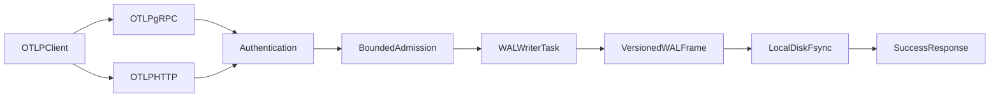
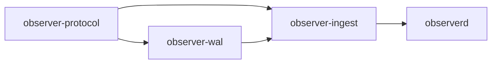
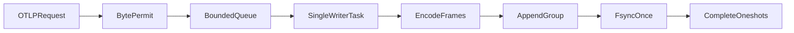

# Durable ingestion roadmap

## Goal and invariant

Build ingestion incrementally until Observer can truthfully guarantee:

> A successful OTLP response means the canonical raw OTLP Protobuf request has been written and `fsync`ed on one local disk.

The guarantee is **at-least-once**, not exactly-once. If a request is durably written but its response is lost, a client retry can create a duplicate. Permanent machine or disk loss is outside the v1 durability contract.

## Target architecture




Dependency direction:




`observer-ingest` currently owns `IngestSink`, while it already depends on `observer-wal`. A direct WAL implementation would therefore create a cycle. Move the shared ingestion contract into `[observer-protocol](/home/sebastien/travaux/observer/crates/observer-protocol/src/lib.rs)` before connecting the WAL.

## Phase 1: Protect OTLP acknowledgement semantics

### Objective

Lock down the network contract before adding filesystem behavior: the gRPC handler must never return success before its sink reports success.

### Changes

- Extend `[logs_grpc.rs](/home/sebastien/travaux/observer/crates/observer-ingest/tests/logs_grpc.rs)` with reusable test sinks:
  - `RecordingSink`: stores accepted batches and succeeds.
  - `FailingSink`: always returns a controlled `AppendError`.
  - `BlockingSink`: signals when `append` starts and waits for the test to release it.
- Keep the existing real loopback Tonic server/client test rather than calling the service method directly.
- Add explicit assertions for status mapping:
  - Sink success → OTLP success with no partial-success response.
  - Sink failure → gRPC `UNAVAILABLE`.
  - Pending sink → client export future remains pending.
- Verify exactly one append call per RPC.
- Verify the stored payload decodes back to the original `ExportLogsServiceRequest`.

### Tests

1. `accepts_an_otlp_logs_request_over_grpc`
2. `does_not_acknowledge_when_sink_fails`
3. `waits_for_sink_before_acknowledging`

Use Tokio timeouts only as test guards. Synchronize the delayed test with channels or notifications rather than sleeps.

### Completion criteria

- A regression that acknowledges before `append()` completes fails deterministically.
- A sink error can never produce an OTLP success response.
- Formatting, Clippy, and the complete workspace test suite pass.

## Phase 2: Move the shared ingestion contract

### Objective

Preserve an acyclic workspace before `observer-wal` implements the sink.

### Changes

- Move the following from `[observer-ingest/src/sink.rs](/home/sebastien/travaux/observer/crates/observer-ingest/src/sink.rs)` into a focused module such as `[observer-protocol/src/ingestion.rs](/home/sebastien/travaux/observer/crates/observer-protocol/src/ingestion.rs)`:
  - `Signal`
  - `AcceptedBatch`
  - `AppendError`
  - `IngestSink`
- Keep `AcceptedBatch.payload` as canonical, uncompressed OTLP Protobuf bytes.
- Keep tenant identity and receive time outside the OTLP payload.
- Re-export the contract from `observer-protocol`.
- Update `observer-ingest` to import the shared contract.
- Remove the now-empty sink module from `observer-ingest`.

### Contract details

`AcceptedBatch` initially carries:

```rust
pub struct AcceptedBatch {
    pub tenant_id: String,
    pub signal: Signal,
    pub received_at_unix_nanos: u64,
    pub payload: Bytes,
}
```

`IngestSink::append` succeeds only after the implementation's durability boundary. For the future WAL sink, that means after `sync_data`.

### Non-goals

- No generic “common” crate.
- No storage representation.
- No WAL cursor or segment concepts in `observer-protocol`.
- No authentication types yet.

### Completion criteria

- Dependency graph remains `observer-protocol → observer-wal → observer-ingest → observerd`, with `observer-ingest` also using `observer-protocol`.
- Phase 1 tests pass unchanged.

## Phase 3: Implement the WAL frame codec

### Objective

Define and test the stable on-disk entry representation without involving files or async code.

### Proposed frame layout

Use fixed-width little-endian integers and an explicit format version:

```text
total_length             u32
format_version           u8
signal                   u8
flags                    u16
sequence                 u64
received_at_unix_nanos   u64
tenant_length            u16
reserved                 u16
payload_length           u32
tenant                   bytes
payload                  bytes
crc32c                   u32
```

`total_length` covers the complete frame after the length field, including CRC. CRC32C covers all bytes from `format_version` through the payload, excluding `total_length` and the CRC field itself.

Initial limits:

- Tenant ID: 1 KiB.
- Raw OTLP payload: 16 MiB.
- Unknown flags: reject.
- Supported signals: logs initially, with stable discriminants reserved for traces and metrics.

### Files

- `[observer-wal/src/frame.rs](/home/sebastien/travaux/observer/crates/observer-wal/src/frame.rs)`: frame-domain types and constants.
- `[observer-wal/src/codec.rs](/home/sebastien/travaux/observer/crates/observer-wal/src/codec.rs)`: bounded encoder and decoder.
- `[observer-wal/src/error.rs](/home/sebastien/travaux/observer/crates/observer-wal/src/error.rs)`: typed format and validation errors.
- `[observer-wal/src/lib.rs](/home/sebastien/travaux/observer/crates/observer-wal/src/lib.rs)`: minimal public exports.

### Decoder rules

- Validate fixed header availability before reading fields.
- Validate declared sizes before allocating.
- Use checked integer arithmetic for every length calculation.
- Reject unsupported versions, unknown signal values, and non-zero unknown flags.
- Distinguish incomplete input from corrupt input so recovery can handle torn tails safely.
- Return consumed byte count to support sequential segment scanning.

### Tests

- Encode/decode round trip.
- Empty payload.
- UTF-8 tenant IDs and invalid UTF-8 tenant bytes.
- Maximum accepted tenant and payload sizes.
- One-byte-over-limit rejection.
- Truncation at every byte offset.
- Declared length smaller or larger than actual frame.
- Integer-overflow attempts.
- Unsupported version and unknown signal.
- Unknown flags.
- CRC mismatch in header metadata, tenant, payload, and checksum.
- Multiple concatenated frames decode sequentially.
- Trailing data behavior is explicit.

### Completion criteria

- Codec is deterministic and has no filesystem, Tokio, Tonic, or OTLP decoding dependency.
- Malformed input cannot trigger unbounded allocation or panic.

## Phase 4: Add a durable single-lane WAL

### Objective

Write complete frames to one active segment and return a receipt only after local-disk synchronization succeeds.

### Segment header

Each segment begins with a fixed, checksummed header:

```text
magic                    8 bytes
segment_format_version   u16
header_length            u16
lane_id                  u32
segment_id               u64
first_sequence           u64
created_at_unix_nanos    u64
header_crc32c            u32
```

Only lane `0` exists initially, but persisting `lane_id` avoids a format redesign when lanes are introduced later.

### Files and naming

```text
wal/
  lane-0000/
    00000000000000000000.open
```

- `.open`: active appendable segment.
- `.wal`: sealed immutable segment, introduced during rotation.
- Segment IDs and sequences are monotonically increasing.

### API

Implement in `[observer-wal](/home/sebastien/travaux/observer/crates/observer-wal/src)`:

```rust
pub struct WalConfig {
    pub directory: PathBuf,
    pub max_entry_bytes: usize,
    pub target_segment_bytes: u64,
}

pub struct Receipt {
    pub sequence: u64,
    pub segment_id: u64,
    pub offset: u64,
}

pub struct Wal { /* owns active file and sequence */ }
```

Initial operations:

- `Wal::open(config)`
- `Wal::append(batch)`
- `Wal::sync()`

Start with a synchronous implementation. The future async writer task will own it and isolate blocking file operations from Tokio workers.

### Append sequence

1. Validate batch limits.
2. Assign the next sequence.
3. Encode a complete frame in memory.
4. Append the frame with complete-write semantics.
5. Call `File::sync_data()`.
6. Return `Receipt`.

Do not return a receipt after a short write or failed sync. Once the WAL enters an uncertain I/O state, mark it failed and reject subsequent appends until reopened and recovered.

### Tests

- New directory and active segment creation.
- Segment header round trip.
- Multiple appends preserve sequence and offset.
- A returned receipt points to a decodable frame.
- Oversized tenant/payload is rejected before writing.
- Reopen preserves existing data and next sequence.
- Injectable short-write, write-error, and sync-error behavior using a small internal I/O abstraction used only for tests.

### Completion criteria

- Successful append implies successful `sync_data`.
- The complete WAL can be scanned after closing and reopening.
- No async or group-commit behavior yet.

## Phase 5: Recover interrupted writes

### Objective

Make startup deterministic after process, kernel, or power interruption.

### Recovery algorithm

1. Discover segment files for lane `0`.
2. Parse IDs from filenames and sort numerically.
3. Validate segment continuity and headers.
4. Scan each frame from the segment-header boundary.
5. Track the last valid offset and highest sequence.
6. For the final `.open` segment:
  - Truncated frame at EOF → truncate to last valid offset.
  - CRC-invalid final frame whose declared bytes reach EOF → treat as torn tail and truncate.
7. For sealed segments or corruption before the physical tail:
  - Stop startup and report a fatal corruption error.
8. Seek the active file to its recovered end.
9. Continue with `highest_sequence + 1`.

Never scan forward looking for another apparent frame boundary after corruption. Silent resynchronization risks converting corruption into plausible but incorrect telemetry.

### Crash fixtures

Generate a valid segment, then derive cases by truncating it:

- Every byte of the segment header.
- Every byte of a frame fixed header.
- Tenant body.
- Payload body.
- CRC.
- Exactly after a valid frame.
- Garbage following the final valid frame.
- Bit flips in an earlier frame.
- Duplicate, missing, and out-of-order segment IDs.

### Tests

- Tail truncation produces the same valid prefix every time.
- Recovery is idempotent across repeated opens.
- New append after recovery yields a valid next frame.
- Mid-segment corruption is fatal and never silently discarded.
- Unsupported segment/frame versions are fatal.

### Completion criteria

- Every simulated torn-tail case recovers to the last fully checksummed frame.
- Every ambiguous non-tail corruption prevents readiness.

## Phase 6: Rotate and seal segments safely

### Objective

Bound active-file size while preserving crash-safe segment continuity.

### Defaults

- Target segment size: 256 MiB.
- Absolute frame limit remains 16 MiB plus framing.
- If one valid frame would cross the target, rotate before writing it.
- A segment may exceed the target only when a permitted single frame cannot fit in an otherwise empty segment.

### Rotation sequence

1. Finish the current append group.
2. `sync_data` the active segment.
3. Rename `<id>.open` to `<id>.wal`.
4. Fsync the lane directory so the rename is durable.
5. Create `<id + 1>.open` with a new segment header.
6. `sync_data` the new header.
7. Fsync the lane directory for durable creation.
8. Continue appending.

At startup, allow exactly one active `.open` segment. Multiple active segments or gaps are fatal unless a narrowly defined interrupted-rotation state can be resolved without guessing.

### Tests

- Rotation immediately before threshold crossing.
- Sequence continuity across segments.
- Reopen with sealed and active segments.
- Empty active segment.
- Crash after sealing but before new segment creation.
- Crash after new file creation but before header sync.
- Duplicate `.open` files.
- Directory operation failures.

### Completion criteria

- Recovery always chooses one unambiguous active segment.
- No acknowledged frame is lost or overwritten during rotation.

## Phase 7: Add the async WAL sink and group commit

### Objective

Integrate durable disk writes into the async OTLP path without blocking request tasks.

### Writer design




- One task exclusively owns the synchronous `Wal`.
- Each submission contains:
  - `AcceptedBatch`
  - precomputed admission byte cost
  - one-shot response sender
- Bound queued work by total bytes using a semaphore; a message-count-only bound is insufficient.
- Request tasks await their individual response.

### First increment

- Process one request at a time.
- Append and sync each request.
- Implement `IngestSink` for the WAL handle.
- Run the Phase 1 success, failure, and delayed-ack tests against a real temporary WAL.

### Group-commit increment

Collect requests until the first condition is met:

- Pending bytes reach 1 MiB.
- Group deadline reaches 2 ms.
- Shutdown begins.

Then:

1. Encode and append every frame in sequence.
2. Call one `sync_data`.
3. Complete every request in the group only after sync succeeds.

If encoding, writing, or sync fails, fail every unacknowledged request in the affected group and transition the writer to a failed state. Never acknowledge a subset after an uncertain group write.

### Error mapping

- Invalid/oversized request: `INVALID_ARGUMENT`.
- Admission byte limit exhausted: `RESOURCE_EXHAUSTED`.
- WAL unavailable or failed: `UNAVAILABLE`.
- Internal invariant violation: `INTERNAL` and failed readiness.

### Shutdown

1. Stop accepting new submissions.
2. Drain the queue.
3. Flush and sync the final group.
4. Resolve all waiting responses.
5. Close the writer task.

### Tests

- Acknowledgement occurs after sync, never merely after enqueue.
- Concurrent callers receive the correct individual receipt.
- One fsync acknowledges a complete group.
- Queue byte permits are released on success and all error paths.
- Saturation rejects rather than waiting without bound.
- Writer failure propagates to queued and future requests.
- Graceful shutdown flushes accepted requests.

### Completion criteria

- The real OTLP logs service satisfies the durable acknowledgement invariant.
- Network request tasks perform no blocking filesystem calls.

## Phase 8: Add OTLP/HTTP Protobuf logs

### Objective

Support the standard OTLP HTTP endpoint without duplicating ingestion semantics.

### Endpoint

- `POST /v1/logs`
- Initially accept only `Content-Type: application/x-protobuf`.
- Decode `ExportLogsServiceRequest`.
- Re-encode canonical Protobuf before creating `AcceptedBatch`.
- Submit through the same `IngestSink`.
- Return Protobuf `ExportLogsServiceResponse`.

### Shared path

Extract transport-independent preparation:

```text
decoded OTLP request
  → structural validation
  → canonical protobuf encoding
  → AcceptedBatch
  → IngestSink
```

Both gRPC and HTTP must call this path.

### Limits and status mapping

- Compressed and decompressed body limits are separate once compression is added.
- Unsupported content type → `415`.
- Invalid Protobuf → `400`.
- Oversized request → `413`.
- Admission pressure → `429` or `503`, documented consistently.
- WAL failure → `503`.
- Success → `200` with Protobuf response.

Defer OTLP JSON, CORS, and compression until the Protobuf path is complete.

### Tests

- HTTP success stores the canonical request.
- HTTP and gRPC produce equivalent payload bytes for equivalent requests.
- Invalid Protobuf, wrong content type, oversized body, sink failure, and delayed acknowledgement.

### Completion criteria

- Both standard OTLP transports share one durability and validation path.

## Phase 9: Authenticate and resolve tenants

### Objective

Derive tenant identity from authenticated transport metadata before admission and WAL routing.

### Initial design

- Static configuration maps bearer tokens to stable tenant IDs.
- gRPC reads `authorization` metadata.
- HTTP reads the `Authorization` header.
- Tokens use `Bearer <token>`.
- Compare secret material in constant time.
- Pass authenticated tenant context to the shared ingest path.
- Store only tenant ID in the WAL; never store or log bearer tokens.

### Rules

- Missing or malformed token → unauthenticated.
- Unknown token → unauthenticated.
- Disabled tenant → permission denied.
- Tenant identity in telemetry resource/log attributes is ordinary user data and never controls routing.
- Apply per-tenant queued-byte accounting before global admission.

### Tests

- Valid token maps to expected WAL tenant.
- Missing, malformed, unknown, and disabled tokens are rejected before sink invocation.
- Telemetry attributes cannot override tenant.
- Logs and errors never contain the token.

### Completion criteria

- Every accepted WAL frame has a server-authenticated tenant ID.

## Phase 10: Activate `observerd`

### Objective

Turn `[observerd](/home/sebastien/travaux/observer/crates/observerd/src/main.rs)` into the production composition root only after durable ingestion exists.

### Responsibilities

- Parse and validate configuration.
- Open and recover the WAL.
- Start the async writer.
- Start OTLP/gRPC on `4317`.
- Start OTLP/HTTP on `4318`.
- Expose liveness, readiness, and internal metrics on a separate admin listener.
- Coordinate graceful shutdown.

### Readiness

Readiness is false when:

- WAL recovery is incomplete.
- The writer task has failed.
- Disk free space is below the configured safety threshold.
- Authentication configuration is invalid.
- Either required ingest listener failed to bind.

Liveness should indicate process health, not storage availability; temporary WAL pressure should fail readiness rather than trigger restart loops.

### Graceful shutdown

1. Mark readiness false.
2. Stop accepting new HTTP/gRPC requests.
3. Wait for active handlers to finish admission.
4. Close the admission sender.
5. Drain queued batches.
6. Append and fsync the final group.
7. Stop listeners and writer.
8. Exit success only after clean drain.

### Initial internal metrics

- Accepted/rejected requests, records, and bytes.
- Decode failures.
- Queue used/capacity bytes.
- Queue wait duration.
- WAL append and sync duration.
- Requests and bytes per sync group.
- Segment count and rotations.
- Recovery duration and truncated bytes.
- WAL disk usage and free space.
- Writer failure state.

### End-to-end tests

- Launch `observerd` with a temporary directory and static token.
- Send logs with a real OTLP client.
- Verify success, terminate, restart, and scan the persisted request.
- Kill during append/group commit and verify only acknowledged valid frames remain.
- Saturate admission and verify explicit rejection.
- Graceful shutdown drains accepted requests.

### Completion criteria

- The daemon never listens for production ingestion without a healthy durable WAL.
- Every successful OTLP response can be traced to a valid checksummed frame recovered after restart.

## Verification

Run at every phase:

```bash
cargo fmt --all --check
cargo clippy --workspace --all-targets -- -D warnings
cargo test --workspace
```

Additional quality gates:

- Frame codec: property-based malformed-input tests and no panics.
- WAL append/recovery: deterministic corruption fixtures.
- Async sink: concurrency, saturation, and failure-injection tests.
- Daemon: process kill/restart tests on a real filesystem.

Implement phases as separate reviewable commits. Do not add traces, metrics, compression, multiple WAL lanes, replication, Parquet, or storage-engine consumers until this logs-only durable ingestion path is complete.